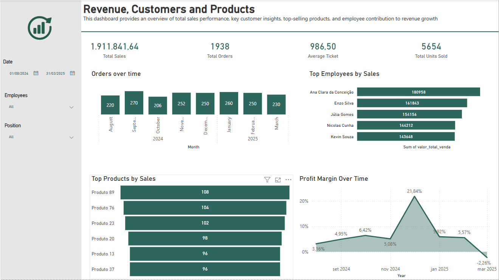
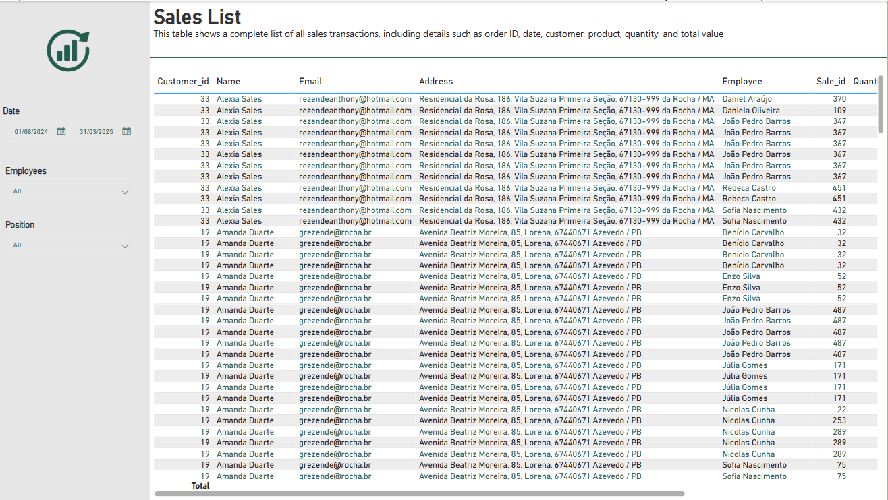

# 📊 Sales Analytics Dashboard

This Power BI project presents an interactive **Sales Analytics Dashboard** with key metrics and detailed sales data.

---

## 📸 Preview

Below you can see a preview of the dashboard pages:

**Main Dashboard**

**Sales List**

> *Replace the image paths if needed — make sure your images are in the same repository folder.*

---

## 📈 Overview

The dashboard provides a clear view of overall sales performance, including:
- **Revenue**: Total sales generated.
- **Total Orders**: Number of sales orders.
- **Average Ticket**: Average value per order.
- **Total Units Sold**: Total quantity of products sold.
- **Orders Over Time**: Monthly trend of orders.
- **Top Employees by Sales**: Ranking of employees by sales value.
- **Top Products by Sales**: Most sold products.
- **Profit Margin Over Time**: Profitability trends month by month.

---

## 📑 Detailed Sales List

A dedicated page displays a complete **Sales List**, including:
- Customer ID, Name, Email, and Address.
- Employee responsible for each sale.
- Sale ID, Quantity, and Total Value.

This table helps to track individual transactions for auditing, customer service, or deeper analysis.

---

## ✅ Filters and Slicers

The dashboard includes filters to slice the data by:
- **Date**
- **Employees**
- **Position**

---

## ⚙️ Tools Used

- **Power BI Desktop**
- Custom measures and visuals

---

**Feel free to clone this project and customize it!**
